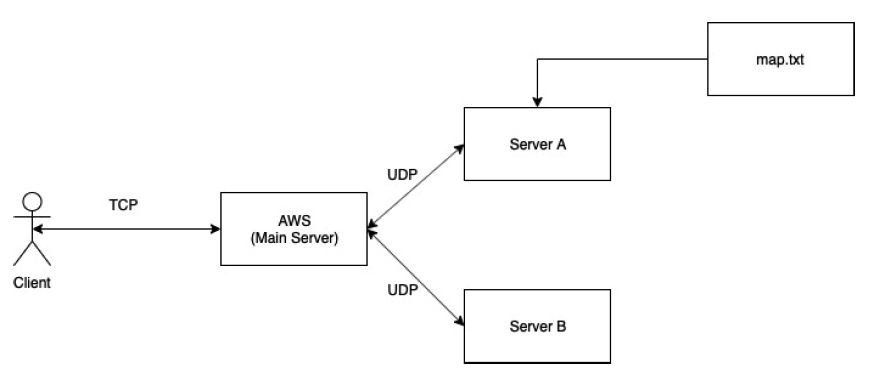
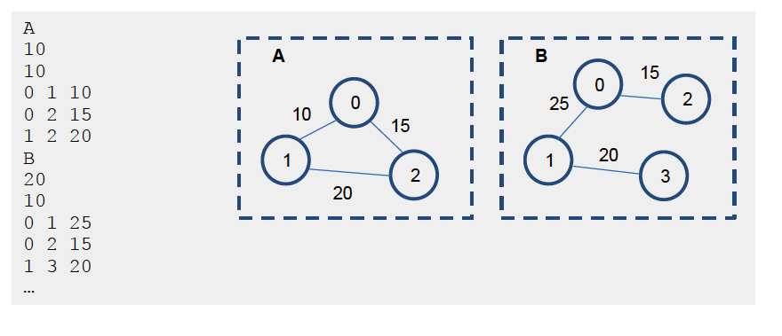

# Project Description

Many network related applications require fast identification of the shortest path between a pair of nodes to optimize routing performance. Given a weighted graph 𝐺(𝑉,𝐸) consisting of a set of vertices 𝑉 and a set of edges 𝐸, we aim at finding the path in 𝐺 connecting the source vertex 𝑣1 and the destination vertex 𝑣𝑛, such that the total edge weight along the path is minimized.

    
 

Dijkstra Algorithm is a procedure of finding the shortest path between a source and destination nodes. This algorithm will be discussed later in the semester. In this project, you will implement a distributed system to compute shortest path based on client’s query. Suppose the system stores maps of a city, and the client would like to obtain the shortest path and the corresponding transmission delay between two points in the city. The figure below summarizes the system architecture. The distributed system consists of three computation nodes: a main server (AWS), connected to two backend servers (Server A and Server B). On the backend server A, there is a file named map.txt storing the map information of the city. The AWS server interfaces with the client to receive his query and to return the computed answer. The backend servers, A and B, perform the actual shortest path and transmission delay computation based on the message forwarded by AWS server.
Detailed computation and communication steps performed by the system is listed below:

1. [Communication] Client -> AWS: client sends the map ID, the source node in the map and the transmission file size (unit: bit) to AWS via TCP.
2. [Communication] AWS -> ServerA: AWS forwards the map ID and source node to serverA via UDP.
3. [Computation] ServerA reads map information from map.txt, uses Dijkstra to find the shortest path from input source to all the other nodes and print them out in a pre-defined format.
4. [Communication] ServerA -> AWS: ServerA sends the outputs of Dijkstra to AWS.

5. [Communication] AWS -> ServerB: AWS sends to ServerB the file size as well as the outputs of ServerA.
6. [Computation] ServerB calculates the transmission delay, propagation delay and end to end delay for each path.
7. [Communication] ServerB -> AWS: ServerB sends the calculated delay values to AWS.
8. [Communication] AWS -> client: AWS sends to client the shortest path and delay results, and client prints the final results.
   The map information of the city is stored in a file named map.txt, stored in ServerA. The map.txt file contains information of multiple maps (i.e. graphs), where each map can be considered as a community of the city. Within each map, the edge and vertex information are further specified, where an edge represents a communication link. We assume edges belonging to the same map have identical propagation speed and transmission speed.

    
    

## 1. What have I done in this assignment:

    Finished all the requirements in the Project assignment.
    Bascically, a client and three servers, including AWS server,
    serverA and serverB.The client can send query to AWS to
    get shortest path and delays from a source vex in a map.

## 2. What each file does:

- client.cpp: Client could send query to aws server and display the results.
- aws.cpp: AWS server could communicate with server A, server B and client so that
  it can send query info and calculation result among them.
- serverA.cpp: Server A could construct city map and find the shortest path from a source vex
  and send the results back to AWS.
- serverB.cpp: Server B could compute transimission delay, propogation delay and total delay for
  the shortest path found by Server A.

## 3. The format of all the messages exchanged:

All message used to send and received among client and servers are char array.

## 4. Idiosyncrasy:

I run server test cases and I did not find any errors under the condition that the vex must be included in the map.

## 5. Reuse of the code:

Some code block for setting TCP and UDP are from "Beej's Guide to Network Programming -- Using Internet Sockets".
